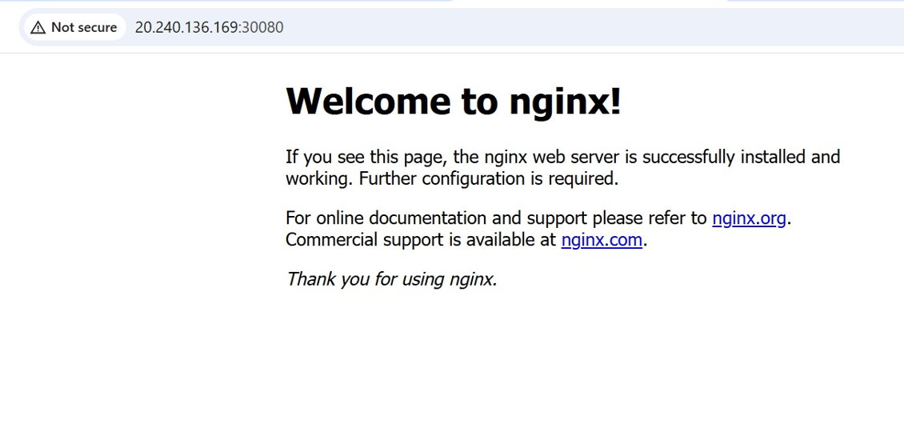
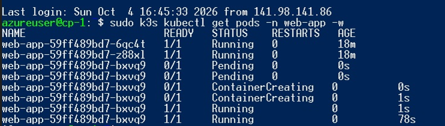
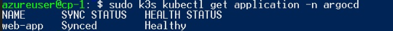
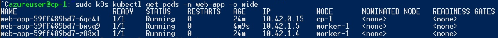

# DevOps Assignment: Kubernetes on Azure with Argo CD

A small Kubernetes environment built on Microsoft Azure with Terraform, running a simple web application that is deployed through Argo CD (GitOps).

## 1. Architecture

```text
Microsoft Azure
      |
      v
Terraform  (Resource Group, VNet, Subnet, NSG, Linux VMs)
      |
      v
Ubuntu 24.04 VMs  (10.0.1.10 = control plane, 10.0.1.11+ = workers)
      |
      v
k3s Kubernetes cluster: 1 control plane + N workers
      |
      v
Argo CD  (installed in the cluster, namespace "argocd")
      |
      v
This Git repository  (path: kubernetes/)
      |
      v
nginx web application (2 replicas, NodePort 30080)
```

The number of workers is a Terraform variable (`worker_count`, default `2`, as required by the assignment). The deployment that was actually executed and verified used `worker_count = 1`; see section 11 for the reason.

| Component | Choice | Why |
|---|---|---|
| Kubernetes | k3s | Installed with one command per node, which makes full automation simple |
| Automation | cloud-init (`custom_data`) | Each VM configures itself at first boot, so `terraform apply` is the only manual step |
| Networking | Static private IPs | Workers know the control plane address at boot time |
| App | `nginxinc/nginx-unprivileged` | Runs as a non-root user |
| Delivery | Argo CD with auto-sync | Git is the source of truth for the application |

Repository layout:

```text
devops-assignment/
├── terraform/     Azure infrastructure (providers, variables, main, outputs)
├── scripts/       cloud-init templates for the control plane and the workers
├── kubernetes/    Deployment and Service for the web application
├── argocd/        Argo CD Application that points at kubernetes/
├── docs/          Screenshots of the verified deployment
└── README.md
```

## 2. Prerequisites

- An Azure subscription (a free account works, see the limitations about quota)
- Azure CLI, Terraform >= 1.5, and kubectl installed locally
- An SSH key pair: `ssh-keygen -t ed25519 -f ~/.ssh/lh_assignment`
- Your public IP address (for example `curl ifconfig.me`)
- This repository must be **public** and pushed to GitHub before deployment, because the control plane downloads `argocd/application.yaml` from GitHub and Argo CD pulls the manifests from it without credentials.

## 3. Deploy the Azure infrastructure

```bash
az login
az account show          # note the subscription id

cd terraform
cp terraform.tfvars.example terraform.tfvars
# edit terraform.tfvars (see the example file)

terraform init
terraform plan
terraform apply
```

Example `terraform.tfvars` for the configuration that was verified (free subscription, 4 vCPU limit):

```hcl
subscription_id = "<your subscription id>"
allowed_ip_cidr = "<your public IP>/32"
location        = "swedencentral"
cp_vm_size      = "Standard_B2ls_v2"
worker_vm_size  = "Standard_B2ls_v2"
worker_count    = 1
```

For the full topology required by the assignment (1 control plane + 2 workers), set `worker_count = 2` (the default). This needs enough vCPU quota for the chosen sizes.

Terraform creates:

- 1 Resource Group
- 1 Virtual Network (10.0.0.0/16) and 1 Subnet (10.0.1.0/24)
- 1 Network Security Group attached to the subnet
- 1 Public IP, 1 NIC and 1 Linux VM (Ubuntu 24.04 LTS) per node

VMs communicate over the internal Azure network. Azure's default `AllowVnetInBound` rule allows all traffic inside the VNet.

Known provider issue: `terraform apply` can end with `Provider produced inconsistent result after apply ... Root object was present, but now absent` for the NSG or the subnet association. The resource does exist in Azure. Re-run `terraform apply`, or import it, for example:

```bash
terraform import azurerm_subnet_network_security_group_association.assoc \
  "/subscriptions/<sub-id>/resourceGroups/rg-lh-assignment/providers/Microsoft.Network/virtualNetworks/vnet-k8s/subnets/snet-k8s"
```

## 4. Kubernetes installation

Kubernetes is installed automatically at first boot of each VM, using the templates in `scripts/`:

- **Control plane** (`setup-control-plane.sh.tpl`): installs the k3s server, with the public IP added as a TLS SAN.
- **Workers** (`setup-worker.sh.tpl`): install the k3s agent and join the control plane at `https://10.0.1.10:6443` with a shared token. The token is generated by Terraform (`random_password`). The join step retries until the control plane is reachable.

## 5. Argo CD installation

The control plane script installs Argo CD after k3s is ready:

- Namespace `argocd`
- Official install manifest, pinned to version v3.1.0
- `--server-side` apply, because some Argo CD CRDs are too large for client-side apply

## 6. Connecting Argo CD to the repository

`argocd/application.yaml` defines an Argo CD `Application` that points at this repository:

- `repoURL`: this GitHub repository (public, so no credentials are needed)
- `path`: `kubernetes`
- `targetRevision`: `main`
- destination: the local cluster, namespace `web-app`

The control plane script applies this file automatically after Argo CD is running.

## 7. Application deployment

The Application has `automated` sync with `prune` and `selfHeal` enabled, and `CreateNamespace=true`:

- **prune** removes cluster resources that are deleted from Git.
- **selfHeal** reverts manual changes made directly in the cluster.

Argo CD reads `kubernetes/deployment.yaml` (2 replicas) and `kubernetes/service.yaml` (NodePort 30080) and applies them. No manual `kubectl apply` is used for the application.

Deployment highlights:

- 2 replicas
- Non-root container, `allowPrivilegeEscalation: false`, all Linux capabilities dropped
- CPU and memory requests and limits

## 8. Accessing the application

```bash
terraform output app_url
```

Open that URL (`http://<control-plane-public-ip>:30080`) in a browser. The NSG allows this port only from `allowed_ip_cidr`.



Argo CD UI (optional), from the control plane:

```bash
ssh -i ~/.ssh/lh_assignment -L 8080:localhost:8080 azureuser@<control-plane-ip>
sudo k3s kubectl -n argocd get secret argocd-initial-admin-secret -o jsonpath="{.data.password}" | base64 -d
sudo k3s kubectl -n argocd port-forward svc/argocd-server 8080:443
```

Then browse to `https://localhost:8080` (user `admin`).

## 9. Verifying the environment

Allow about 8 to 10 minutes after the VMs are created. Then:

```bash
ssh -i ~/.ssh/lh_assignment azureuser@<control-plane-ip>

sudo cloud-init status --wait                     # status: done
sudo k3s kubectl get nodes                        # all nodes Ready
sudo k3s kubectl get pods -A                      # all Running
sudo k3s kubectl get application -n argocd        # web-app: Synced / Healthy
sudo k3s kubectl get pods -n web-app -o wide      # 2 pods Running
```

Troubleshooting: `sudo tail -f /var/log/cloud-init-output.log`

Evidence from the executed deployment (Sweden Central, 1 control plane + 1 worker):





GitOps check: `replicas: 2` was changed to `replicas: 3` in `kubernetes/deployment.yaml` and pushed to `main`. Argo CD created the third pod within seconds of its next sync, with no manual `kubectl apply`. The value was then set back to 2 and Argo CD removed the extra pod.



## 10. Destroying the resources

```bash
cd terraform
terraform destroy
```

If the provider issue from section 3 leaves the resource group undeletable, run `az group delete -n rg-lh-assignment --yes` and remove the local `terraform.tfstate*` files.

## 11. Assumptions and limitations

**Why the verified deployment has 2 nodes instead of 3**

The assignment asks for 1 control plane and 2 workers, and the code supports that (`worker_count = 2`, the default; `terraform plan` for the full 3-VM topology succeeded with 15 resources). The deployment that I executed on a free Azure subscription used 1 worker, because of capacity limits on that subscription:

- The subscription has a limit of 4 vCPU per region.
- `westeurope` rejected new resources for this subscription (`RequestDisallowedByAzure`, region not accepting new customers).
- In `germanywestcentral`, `northeurope`, `swedencentral`, `polandcentral` and `uksouth`, VM sizes with 1 vCPU (and the B series in several regions) failed with `SkuNotAvailable` (capacity restrictions).
- Only 2 vCPU sizes had capacity (for example `Standard_B2ls_v2` in `swedencentral`), and three of those need 6 vCPU, which is above the quota.
- Therefore the largest cluster that fits is 1 control plane + 1 worker with 2 vCPU each (4 vCPU in total).

Nothing else changes between the two topologies: the worker join logic is the same, and a second worker is added by setting `worker_count = 2` once the quota or capacity allows it (3 x 2 vCPU needs a quota of 6, or smaller worker sizes).

Other notes:

- Capacity and quotas in Azure change over time, so results in other subscriptions and regions may differ.
- In k3s the control plane node is schedulable, so application pods can run on it as well (in the verified deployment one replica ran on `cp-1` and one on `worker-1`).
- The repository is public so Argo CD can pull it without credentials. A private repo would need a deploy key or token.
- The k3s join token is stored in VM custom data. In production it would come from Azure Key Vault.
- All VMs have public IPs, restricted by the NSG to the admin IP. Production would use private nodes, a bastion host, and a NAT gateway.
- Single control plane, so no high availability.
- Terraform state is local. Production would use an Azure Storage backend with locking.
- The application is HTTP only (NodePort), with no Ingress or TLS.
- Argo CD and the image are pinned to versions. Check for newer releases before reuse.
- The API server (6443), SSH (22) and the app (30080) are open only to `allowed_ip_cidr`. If your IP changes, update the variable and re-apply.

## Verification status

- `terraform init`, `terraform validate` and `terraform plan` pass.
- The full deployment was executed on Azure (region `swedencentral`): k3s cluster with 1 control plane and 1 worker, both nodes Ready, Argo CD installed, `web-app` Synced and Healthy with 2 running replicas, application reachable in the browser, GitOps scaling test passed.
- The environment was destroyed after the test.
